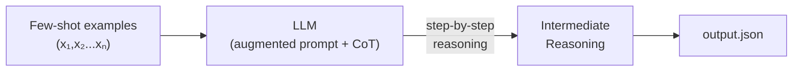

# CoT (Augmented Baseline)

```mermaid
%%{init: {'flowchart': {'nodeSpacing': 30, 'rankSpacing': 60}}}%%
flowchart LR
    FS["Few-shot examples<br>(x₁,x₂...xₙ)"] --> LLM["LLM<br>(augmented prompt + CoT)"]
    LLM -->|"step-by-step<br>reasoning"| THINK["Intermediate<br>Reasoning"]
    THINK --> OUT["output.json"]
```
