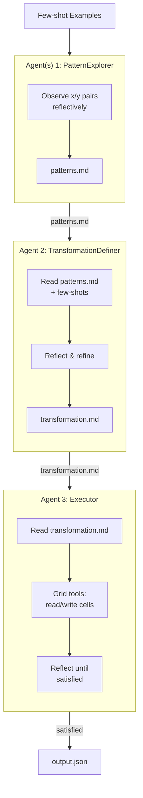

# 3-Step Agentic Pipeline

```mermaid
%%{init: {'flowchart': {'nodeSpacing': 40, 'rankSpacing': 60, 'subGraphTitleMargin': {'top': 10, 'bottom': 10}}}}%%
flowchart TD
    FS["Few-shot Examples"]

    subgraph A1["Agent(s) 1: PatternExplorer"]
        direction TB
        A1a["Observe x/y pairs<br>reflectively"] --> A1b["patterns.md"]
    end

    subgraph A2["Agent 2: TransformationDefiner"]
        direction TB
        A2a["Read patterns.md<br>+ few-shots"] --> A2b["Reflect & refine"] --> A2c["transformation.md"]
    end

    subgraph A3["Agent 3: Executor"]
        direction TB
        A3a["Read transformation.md"] --> A3b["Grid tools:<br>read/write cells"] --> A3c["Reflect until<br>satisfied"]
    end

    FS --> A1
    A1 -->|"patterns.md"| A2
    A2 -->|"transformation.md"| A3
    A3 -->|"satisfied"| OUT["output.json"]
```
