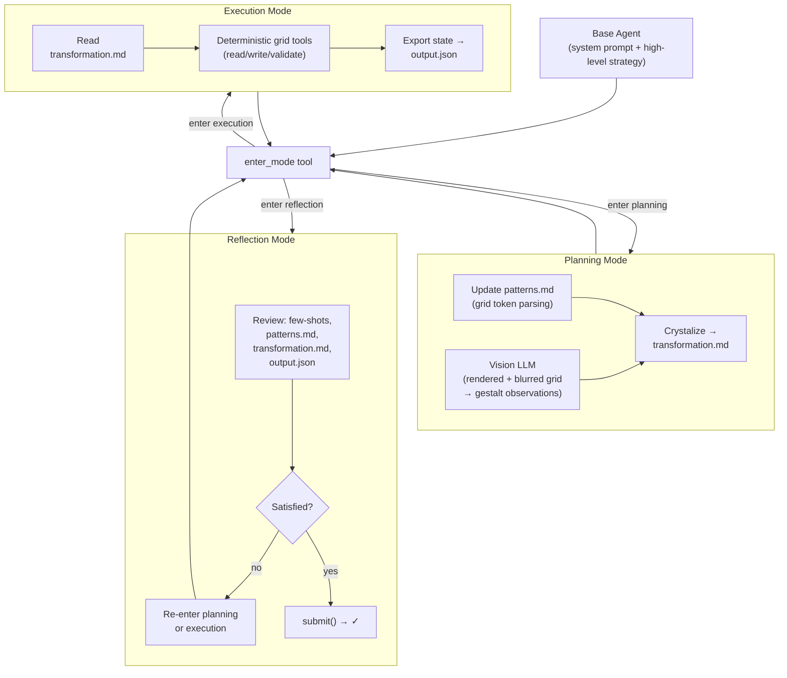

# Single Reflective Agent

```mermaid
%%{init: {'flowchart': {'nodeSpacing': 50, 'rankSpacing': 70}}}%%
flowchart TD
    BASE["Base Agent<br>(system prompt + high-level strategy)"]
    BASE --> ENTRY["enter_mode tool"]

    ENTRY -->|"enter planning"| PLAN
    ENTRY -->|"enter execution"| EXEC
    ENTRY -->|"enter reflection"| REFLECT

    subgraph PLAN["Planning Mode"]
        direction LR
        P1["Update patterns.md<br>(grid token parsing)"]
        P2["Vision LLM<br>(rendered + blurred grid<br>→ gestalt observations)"]
        P1 & P2 --> P3["Crystalize →<br>transformation.md"]
    end

    subgraph EXEC["Execution Mode"]
        direction LR
        E1["Read<br>transformation.md"] --> E2["Deterministic grid tools<br>(read/write/validate)"] --> E3["Export state →<br>output.json"]
    end

    subgraph REFLECT["Reflection Mode"]
        direction LR
        R1["Review: few-shots,<br>patterns.md,<br>transformation.md,<br>output.json"]
        R1 --> R2{"Satisfied?"}
        R2 -->|"no"| R3["Re-enter planning<br>or execution"]
        R2 -->|"yes"| SUBMIT["submit() → ✓"]
    end

    PLAN --> ENTRY
    EXEC --> ENTRY
    R3 --> ENTRY
```
